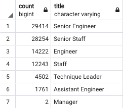
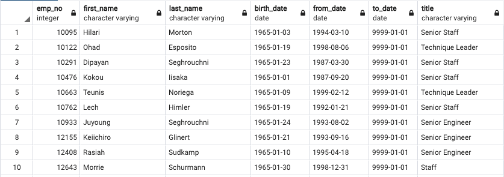
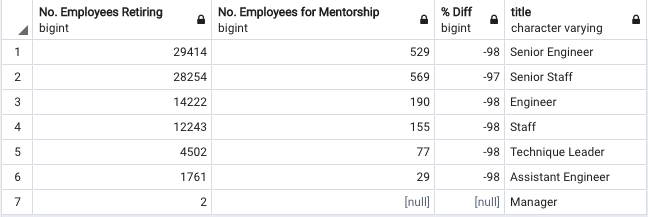
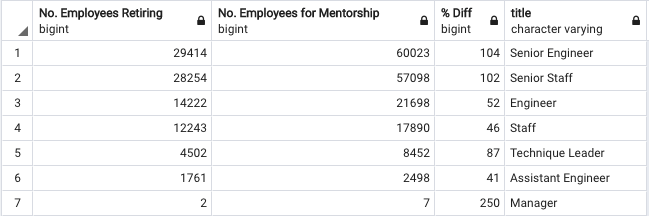

# **Pewlett Hackard Analysis**

## **1. Overview of the Pewlett Hackard Analysis**
Bobby, an HR analyst for Pewlett Hackard has been tasked with determining which employees will be retiring in the next few years and subsequently, how many positions will need to be filled.  

As the number of baby boomers getting ready to retire are staggering, we want to ensure that Pewlett Hackard is well prepared for the "silver tsunami" by setting up a mentorship program.  

In this analysis, we will help Bobby find out the number of retiring employees by title, number of employees eligible for the mentorship program and use these results to analyze how well prepared the company is for the retirement of a large portion of their workforce.

## **2. Pewlett Hackard Results**
**Deliverable 1**: Number of Retiring Employees by Title
- We first created an overall [retirement table by title](Data/retirement_titles.csv) by narrowing the full employment list by those born between 1952 and 1955.  The result of this first table was that some employees showed up multiple times as they held different titles throughout their career at Pewlett Hackard. 

- To ensure that an employee is only being counted once, we created a second table from the first table data using the *DISTINCT ON* function on the employee number to only pull unique employee numbers.  The result was the [unique titles table](Data/unique_titles.csv).

- Finally, the main goal of this first objective was to see the number of retiring employees by title.  We wrote a query to *COUNT* the employee number and *GROUP BY* title to get the number by title resulting in the table below:

    

**Deliverable 2**: Employees Eligible for the Mentorship Program
- We wanted to create a table to see what employees would be eligible for the mentorship program.  We narrowed the eligible employees to those with years of experience who are closer to retiring but not yet ready to, which we determined were those born in the year 1965.

- We pulled information from the employees, dept_emp and titles tables using *INNER JOIN*.  We did an additonal filter by the to_date from the titles table in order to pull the most recent title for the employee.  The resulting table is as below:

    

## **3. Pewlett Hackard Summary**
**Question 1**:  How many roles will need to be filled as the "silver tsunami" begins to make an impact?

- 90,398 roles will need to be filled.  
- Instead of manually adding up the "count" column in the retiring_titles table, we can run a simple query to sum up the count column.

    ```sql
    SELECT SUM(count)
    FROM retiring_titles;
    ```
**Question 2**: Are there enough qualified, retirement-ready employees in the departments to mentor the next generation of Pewlett Hackard employees?

- We ran additional queries to see the retiring titles and the mentorship eligible titles in the same table. We first created a similar table to the [retiring_titles](Data/retiring_titles.csv) table to show the number of mentorship eligible roles by title using the below query.

    ```sql
    SELECT COUNT(emp_no), title
    INTO mentorship_titles
    FROM mentorship_eligibility
    GROUP BY title
    ORDER BY COUNT(emp_no) DESC;
    ```
- We *LEFT JOIN* the two tables to create a retiring_vs_mentorship table.

    ```sql
    SELECT r.count AS "No. Employees Retiring",
	    me.count AS "No. Employees for Mentorship",
	    (100*(me.count - r.count)/r.count) AS "% Diff",
	    r.title
    INTO retiring_vs_mentorship
    FROM retiring_titles AS r
	    LEFT JOIN mentorship_titles AS me
		    ON (r.title = me.title)
    ORDER BY r.count DESC;
    ```

    

- This analysis shows that there are not enough qualified, retirement-ready employees in each department to mentor the next generation as there are only around 2% mentorship-ready employees to the number of employees retiring.

To provide more insight into the upcoming "silver tsunami" and to better prepare, we ran the following additional queries/tables.

- The current mentorship table narrowed the eligible employees to those born in the year 1965.  We should expand this to include all employees who were born between 1956 to 1965.  We chose 1956-01-01 as the start date as we had filtered the retirement table to end on 1955-12-31, which meant that those born after this date were not considered as part of the "silver tsunami", yet they have the experience to become mentors.  Below is the updated query.

    ```sql
    SELECT DISTINCT ON (e.emp_no) e.emp_no,
	    e.first_name,
	    e.last_name,
	    e.birth_date,
	    de.from_date,
	    tt.to_date,
	    tt.title
    INTO expanded_mentorship_elig
    FROM employees AS e
	    INNER JOIN dept_emp AS de
		    ON (e.emp_no = de.emp_no)
	    INNER JOIN titles as tt
		    ON (e.emp_no = tt.emp_no)
    WHERE (e.birth_date BETWEEN ' 1956-01-01' AND '1965-12-31')
	    AND (tt.to_date = '9999-01-01')
    ORDER BY e.emp_no;
    ```

- As you can see in the new combined table showing retiring titles vs the expanded mentorship eligible titles, we now have more than enough employees who qualify for the mentorship program to prepare the next generation of employees at Pewlett Hackard. 

    